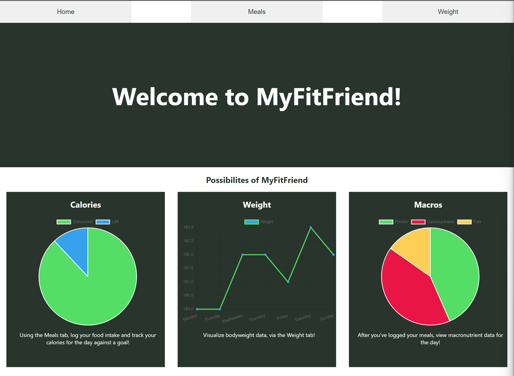

This project is intended to be a MyFitnessPal inspired web app, with meal tracking and macronutrient reporting functionality. 

Enhancements:
I'd like to expand the backend to include login functionality with user data storage
Additionally I'd like to expand upon the meal logging and weight tracking

Overview:

The home page serves to show users what the app can do.
1. Track Calories
2. Track Macronutrients
3. Track Bodyweight

The Meals tab is where you can search for foods as they exist in the USDA Food Database
(https://fdc.nal.usda.gov/)

The input under Search for a food uses the USDA Food Database API in order to query and retrieve the search term. It actually provides a list of the 5 closest matching food descriptions in the database, giving users some extra options to choose from. 

The API Fetch is in the FoodSearch.js Component, and can be further customized in the future, as of right now this uses my personal API key.

The 2 pies at the bottom represent the total caloric consumption for the day, against your goal amount and the other represents the macronutrient data of the foods that have been logged. Each aspect of the pie offers a hover feature that allows you to see the specifics of the zone on the pie.

Eventually this page will be styled differently in order to create a better UI/UX.

Lastly, the Weight tab is self explanatory and will be the first to be enhanced in the future. 

